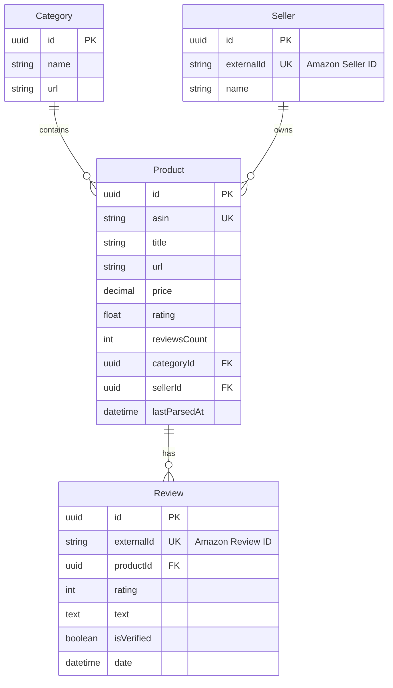

# Amazon Review Scraper — Foundation Layer

## 📌 О проекте
Данная система предназначена для автоматизированного сбора и анализа данных с Amazon. Основной упор сделан на **масштабируемую архитектуру БД**, способную эффективно обрабатывать сотни миллионов отзывов, и **отказоустойчивый парсинг**.

---

### Как развернуть данное приложение:
```bash
git clone git@github.com:Aleksey-00/amazon-scraper.git
yarn install
cd amazon-scraper
docker compose up -d
yarn prisma migrate dev
yarn setup   # установка браузера Chromium для парсера (Playwright)
yarn run parse:category "electronics-headphones" "https://www.amazon.com/s?k=electronics-headphones"
```

---
## 🏗 1. Архитектура базы данных (ER-диаграмма)

Для обеспечения целостности данных и скорости выборок выбрана реляционная модель в PostgreSQL.

### Визуализация связей (Mermaid)


---

## ⚙️ 2. Алгоритм работы (сценарий)

1. **Категория**: в БД заранее создаётся запись `Category` с `url` категории Amazon.
2. **Обработка категории**:
   - `QueueHandler.processCategory(categoryId, categoryUrl)` вызывает `ScraperService.fetchAsinsFromCategory`.
   - Для каждого ASIN парсится карточка товара (`parseProductDetails`) и выполняется `CatalogService.upsertProduct`.
3. **Обработка отзывов**:
   - Для каждого товара вызывается `ScraperService.parseReviews(asin)`.
   - `ReviewsService.saveBatchReviews(product.id, reviews)` делает `upsert` по `externalId`, обновляя только новые или изменившиеся отзывы.
4. **Инкрементальность**:
   - `Product.lastParsedAt` позволяет ограничивать повторный парсинг.
   - `Review.externalId` гарантирует идемпотентность загрузки отзывов.

---

## 🛡 3. Устойчивость парсера

- **Rate limiting и баны**:
  - Используется `playwright-extra` + stealth-плагин, рандомизация `User-Agent` и задержек между запросами.
  - В реальном окружении поверх этого добавляется очередь (BullMQ) с лимитами задач в секунду и контролем параллелизма.
- **Ошибки сети и таймауты**:
  - Каждый вызов обёрнут в `try/catch`, логируется через Nest `Logger`.
  - При ошибках страницы браузер/страница пересоздаётся, запросы можно перезапускать с backoff.
- **Изменение HTML-структуры**:
  - Все CSS-селекторы сосредоточены в `ScraperService`, что упрощает обновление при изменении разметки Amazon.
  - Дополнительно можно ввести метрики (доля успешно распарсенных страниц/элементов) и алерты.
- **Логирование**:
  - Таблица `ParsingLog` хранит статус обработки сущностей (`entityType`, `entityId`, `status`, `errorMessage`, `durationMs`), что позволяет отслеживать прогресс и точки отказа.


---

## Запуск парсера

Убедитесь, что миграции применены: `yarn prisma migrate dev`, и браузер установлен: `yarn setup`.

Второй аргумент — **URL страницы со списком товаров** (поиск или категория), а не главная amazon.com. С главной страницы ASIN'ы не собираются.

**Пример (поиск по запросу "headphones"):**
```bash
yarn parse:category "electronics-headphones" "https://www.amazon.com/s?k=headphones"
```

**Или страница категории:**
```bash
yarn parse:category "electronics-headphones" "https://www.amazon.com/b?node=172282"
```

Логи выводятся в терминал через NestJS Logger.